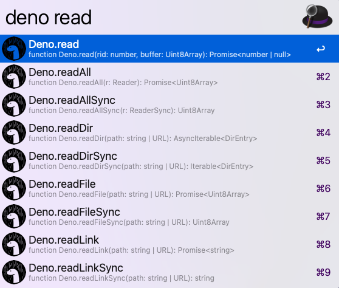

# alfred-deno-doc


Search deno documentation through Alfred 4

<p align="center">

</p>

## 📌 Prerequisite

* Node JS

* [Alfred powerpack](https://www.alfredapp.com/powerpack/)

* Chrome 87.0.4280.88

##  🔨 How to install

1. Install package by npm

```
$ npm install --global alfred-deno-doc
```

2. Run `deno > cache` and wait until notification shows up

## 📗 How to use

### deno { Argument }

Argument: term to search

